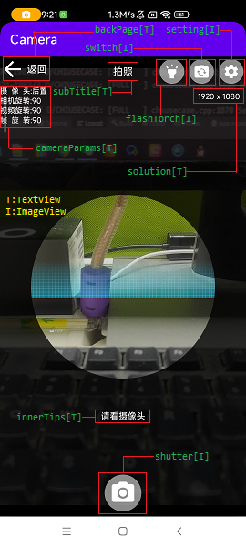
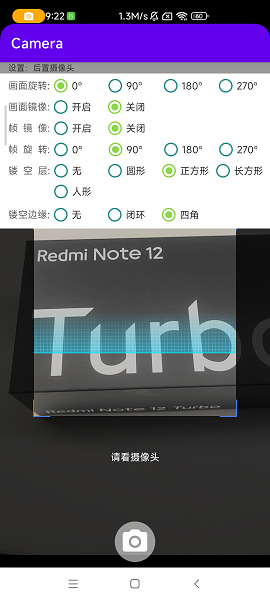
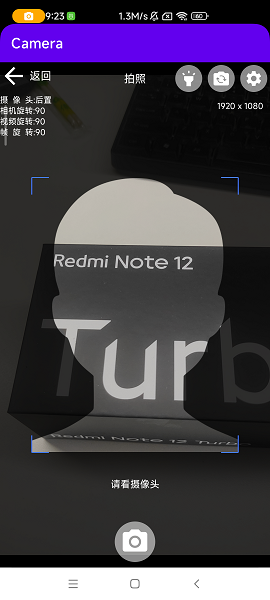

# Camera
相机封装。调用快捷方便。
支持圆形，正方形，长方形，人脸形等镂空区域。
支持扫描动画。





### 1、初始化相机参数
```
CameraParamsManager.getInstance().init(getApplicationContext());
```

### 2、调用相机
```
    private Bitmap bitmap = null;
    private boolean processing = false;
    private final Rect mValidRect = new Rect();
    private final YuvFrame mFrameCache = new YuvFrame();
    private final ExecutorService mService = Executors.newSingleThreadExecutor();
    private final Handler mHandler = new Handler(Looper.getMainLooper());

    private void showCamera() {
        Bundle arguments = new Bundle();
        arguments.putString("customCameraIdKey", getClass().getSimpleName());
        //预览延迟时间，单位：毫秒
        arguments.putLong("previewDelayTime", 200);
        //相机帧回调延迟时间，单位：毫秒
        arguments.putLong("frameDelayTime", 400);
        //是否启用扫描动画
        arguments.putBoolean("withScanAnim", true);
        CameraFragment fragment = new CameraFragment();
        fragment.setArguments(arguments);
        fragment.setCallback(new CameraFragment.CameraLifeCycleCallback() {
            @Override
            public void onViewCreated(Map<String, View> viewCache) {
                //初始化views
                //可在这里控制view的显隐、属性
                viewCache.get("root").setBackgroundColor(Color.BLACK);
                ((TextView) viewCache.get("subTitle")).setText("拍照");
                ((TextView) viewCache.get("innerTips")).setText("请看摄像头");
            }

            @Override
            public void onOpenCamera() {

            }

            @Override
            public void notFoundCamera() {

            }

            @Override
            public void onBack() {
                //这里是点击控件"backPage"回调
                Fragment f = getSupportFragmentManager().findFragmentByTag("_camera");
                if (f != null) {
                    getSupportFragmentManager().beginTransaction().remove(f).commit();
                }
            }

            @Override
            public void onCreateMask(boolean isLandscape, CameraMaskBuilder builder) {
                //这里可以配置镂空区域形状、参数等
            }

            @Override
            public void onMaskCreated(boolean isLandscape, CameraMaskBuilder builder) {
                mValidRect.set(builder.getTransparentRectInFrame());
            }

            @Override
            public void frame(int facing, boolean mirror, int mVideoOrientation, int mFrameOrientation, byte[] yuvData, int width, int height) {
                //这里是相机回调回来的每一帧
            }

            @Override
            public void onShutter(int facing, int displayOrientation, int mFrameOrientation, byte[] yuvData, int width, int height) {
                //这里是点击拍照按钮后回调帧
                if (!processing) {
                    SoundPoolPlayer.getInstance().playShutterVoice();
                    processing = true;
                    mFrameCache.facing = facing;
                    mFrameCache.yuvData = yuvData;
                    mFrameCache.width = width;
                    mFrameCache.height = height;
                    mFrameCache.clipRect = new Rect(mValidRect);
                    mFrameCache.frameRotation = mFrameOrientation;
                    mService.submit(new Runnable() {
                        @Override
                        public void run() {
                            //处理帧：旋转、裁剪
                            YuvUtils.dealOriginalFrameIfN(mFrameCache, false);
                            bitmap = YuvTransfer.getInstance().transfer(mFrameCache);
                            mHandler.post(new Runnable() {
                                @Override
                                public void run() {
                                    binding.ivImg.setImageBitmap(bitmap);
                                }
                            });
                            processing = false;
                        }
                    });
                }
            }

            @Override
            public void onCameraClosed() {

            }
        });
        getSupportFragmentManager().beginTransaction().add(R.id.fy_camera_container, fragment, "_camera").commit();
    }
```